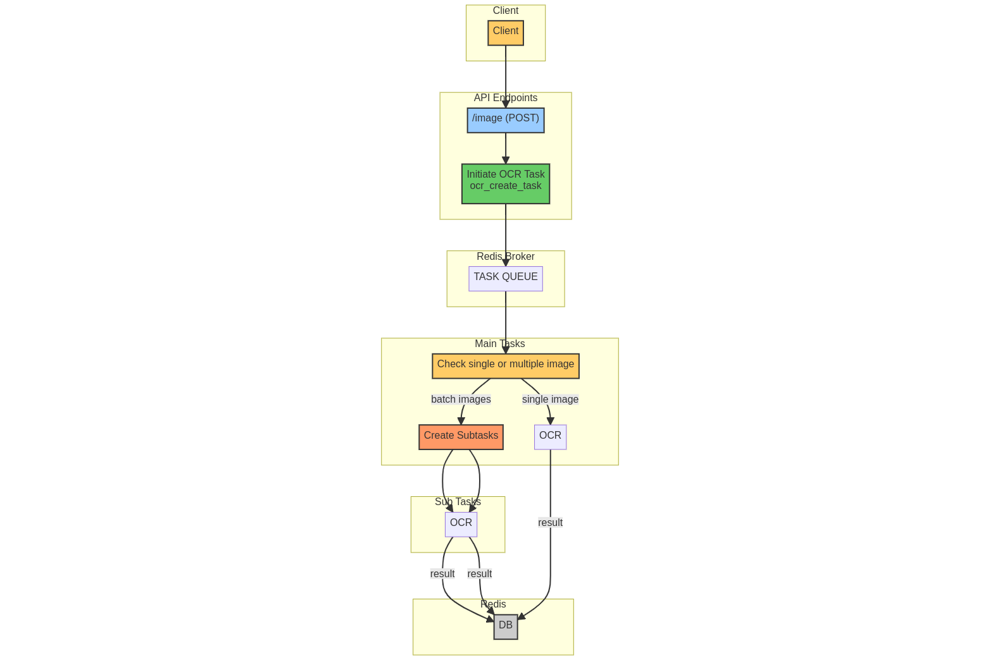

## Overview
FastApi for APIs, Celery for task queue, Redis for broker and storing result, flower for monitoring, fastapi.testclient for testing

The celery worker container and api container are running independently which can be usefull for scaling them with independent configuration, the broker act as a communicator

## Run Instructions

- ```docker compose up```


## API access
http://localhost:5000/docs


- APIs can be tested with the above FastApi docs UI endpoint
- press ```Try it out``` button for of particular API

## Task Monioring
http://localhost:5555


## List of APIs (Description and Usage)

### OCR-SYNC

Perform Synchronous OCR

- **Endpoint**: `/image-sync`
- **Method**: POST
- **Request Body**: { "image_data": "string" } / { "image_data": ["string1", "string2"] }
- **Response**: JSON with OCR results
- **Description**: Perform synchronous OCR on provided image data. Returns recognized text for single images or a list of recognized text for multiple images.
- **Usage**: 
    - send imageRequest (refer [Additional Notes](#additional-notes) to know how to send single or batch images)
    - the response would returns recognized text for single images or a list of recognized text for multiple images.

### OCR-ASYNC-CREATETASK

Initiate Asynchronous OCR Task

- **Endpoint**: `/image`
- **Method**: POST
- **Request Body**: { "image_data": "string" } / { "image_data": ["string1", "string2"] }
- **Response**: JSON with Task ID
- **Description**: Initiate an asynchronous OCR task using Celery. Returns a task ID for monitoring task status and result.
- **Usage**: 
    - send imageRequest (refer [Additional Notes](#additional-notes) to know how to send single or batch images)
    - the response would return task_id which can be used in [OCR-ASYNC-TASKRESULT](#ocr-async-taskresult) to fetch task result


### OCR-ASYNC-TASKRESULT

Retrieve Asynchronous OCR Task Result

- **Endpoint**: `/image`
- **Method**: GET
- **Query Params**: `task_id` (required)
- **Response**: JSON with OCR result or null
- **Description**: Retrieve the result of an asynchronous OCR task. Returns OCR text result for successful tasks or null for pending or failed tasks.
- **Usage**: 
    - send task_id as query param (as obtained from [OCR-ASYNC-CREATETASK](#ocr-async-createtask))
    - the response would returns recognized text for single images or a list of recognized text for multiple images.

### WebSocket

Watch Asynchronous OCR Task Result

- **Endpoint**: `/watch-task`
- **WebSocket**: Connect to monitor task progress
- **Query Params**: `task_id` (required)
- **Description**: Watch the real-time progress and result of an asynchronous OCR task using WebSockets. Connect to this   WebSocket to receive status updates and OCR result.
- **Usage**: 
    - can be used with web-socket client with bash -> 
      
      ```wscat -c ws://localhost:5000/watch-task?task_id={task_id}```

### Additional Notes

The OCR APIs handle various scenarios, including single images and image lists.
For demo I have created txt file for base64 request body, copy paste from them
- **Single Image Request**: ```readme-assets/single-image-request.txt```
- **Multiple Image Request**: ```readme-assets/batch-image-request.txt```

**ImageRequest**: the request body to send base64 image (both asynchronous and synchronous) is of form

- **For sending single Image**:
    Example: 
    ```json
    {  
        "image_data": "image1_base64"
    }
    ```
- **For sending batch of Images**:
    Example: 
    ```json
    {  
        "image_data": ["image1_base64, image2_base64, image3_base64, image4_base64, image5_base ..."]
    }
    ```
- **Leaving unnecessary commans might lead to error**

## Asynchronous API /Image POST Overview

 

